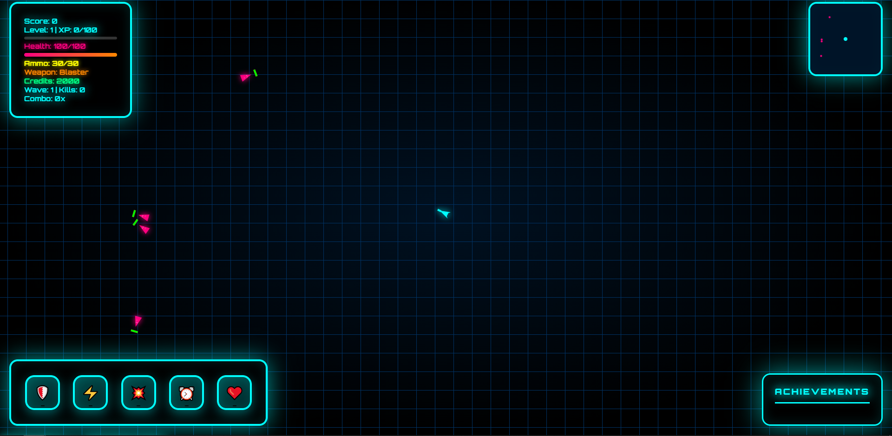

# 🌌 NEON DYSTOPIA ⚔️  
> 🕹️ A retro-futuristic cyberpunk shooter made by a student with lots of love ✨

---

## 📸 Screenshots  
Welcome to the neon world! Here are some pics to give you vibe 😎 

  
*Main menu with vaporwave neon vibes 💜*  

  
*Full action mode with HUD elements and minimap 🌐*

  
*Cool abilities + achievement pop-ups 🏆*

---

## 🤖 What is this?  
**NEON DYSTOPIA** is a **space shooter game** made in pure HTML/CSS/JS 🎮 
You are a cyber-mercenary in a glitched digital world. You shoot enemies, collect credits, buy upgrades and unlock cool stuff 🌌

Made as a personal learning project, but it's already playable and fun 😁 
It’s like if DOOM met Synthwave 💀🎧

---

## 🧠 Features  

✅ Full responsive layout with beautiful neon UI  
✅ Minimap 🗺️  
✅ HUD with health, ammo, EXP, weapon info  
✅ Ability system with cooldowns 💥  
✅ Achievement system (with animations!) 🏅 
✅ Weapon wheel menu 🔫  
✅ Game over screen with detailed stats  
✅ Shop with unlockable upgrades 🛒  
✅ Mobile-friendly button system  
✅ Settings and controls menu ⚙️  
✅ Uses `Orbitron` font for cool sci-fi feeling

---

## 🎮 How to play  
```bash
Just open index.html in your browser 🌐 
````

### 🧠 Option 1: Clone with Git
```bash
git clone https://github.com/Antot-12/NEON-DYSTOPIA.git
cd NEON-DYSTOPIA
````

Then open the `index.html` file in your browser (double click or drag into browser). That's it! ✅

### 💾 Option 2: Download ZIP

1. Go to: [https://github.com/Antot-12/NEON-DYSTOPIA](https://github.com/Antot-12/NEON-DYSTOPIA)
2. Click the green `Code` button 🟩
3. Choose `Download ZIP`
4. Unzip it
5. Open `index2.html` — boom! 💥

---

Controls:

* `WASD` or arrows to move 🚶‍♂️
* `Mouse` to aim 🔫
* `Left click` to shoot
* Press `E` or click abilities to activate 💣
* `R` to reload
* `1/2/3` or scroll to change weapons
* `ESC` or menu to open options/settings

---

## 🔧 Bugs & To-Do List

### 🐞 Known Bugs:

* 🔸 Some buttons don’t respond on smaller screens 📱

### 📝 To Do Next:

* [ ] Create enemy types and AI logic 🧠
* [ ] More achievements 🥇
* [ ] New ability types (freeze, time stop, etc.) ❄️🕰️
* [ ] Better scaling for tablets & phones 📲
* [ ] Story mode (maybe...) 😏

---

## 🧪 Tech Used

* HTML5 + CSS3
* JavaScript
* Custom UI system (no framework!)
* Google Fonts (Orbitron)
* Pure DOM-based rendering
* Super heavy custom CSS with blur, glow, gradients 

---
