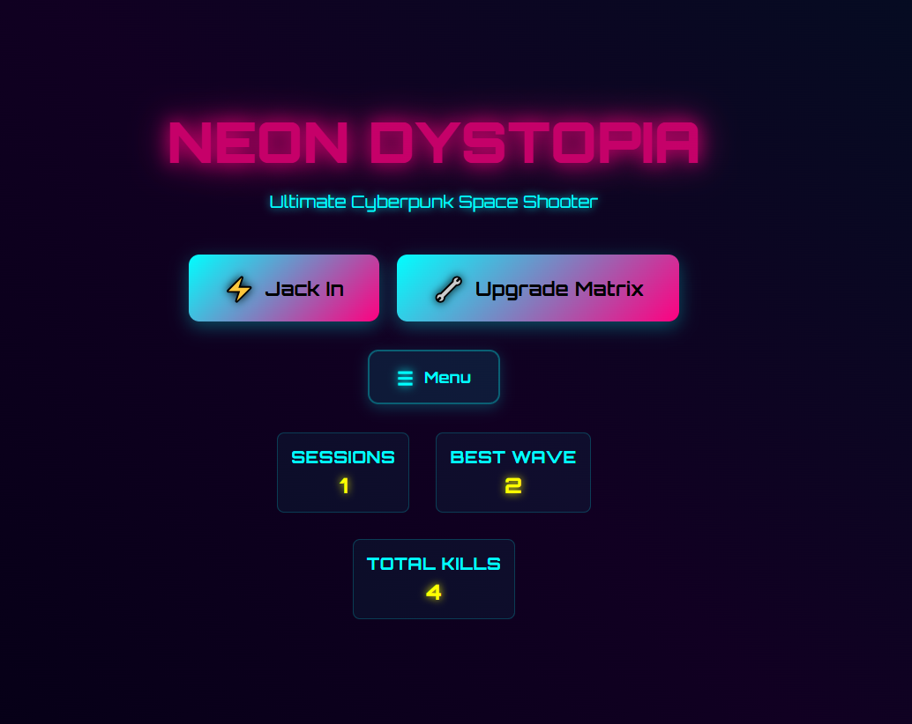
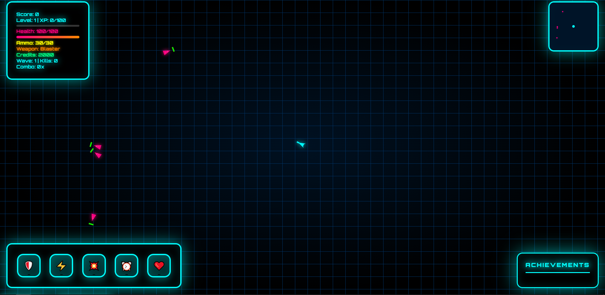
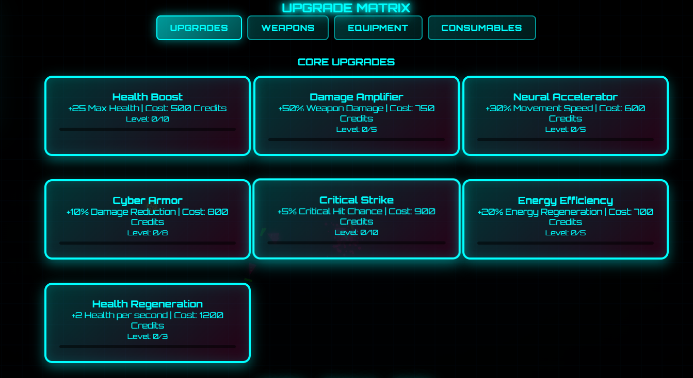

# 🌌 NEON DYSTOPIA - Game Documentation 📚

## Table of Contents
1. [Introduction](#introduction)
2. [Game Overview](#game-overview)
3. [Installation](#installation)
4. [Game Controls](#game-controls)
5. [Game Interface](#game-interface)
6. [Game Mechanics](#game-mechanics)
7. [Weapons System](#weapons-system)
8. [Abilities System](#abilities-system)
9. [Achievement System](#achievement-system)
10. [Shop and Upgrades](#shop-and-upgrades)
11. [Technical Information](#technical-information)
12. [Troubleshooting](#troubleshooting)
13. [Future Development](#future-development)

---

## Introduction <a name="introduction"></a>

**NEON DYSTOPIA** is a retro-futuristic cyberpunk shooter game developed using pure HTML, CSS, and JavaScript. The game immerses players in a glitched digital world where they take on the role of a cyber-mercenary, battling enemies, collecting credits, purchasing upgrades, and unlocking achievements.

The game features a vibrant neon aesthetic with a synthwave-inspired design, reminiscent of classic arcade shooters but with modern web technologies and visual effects.


*Main menu with vaporwave neon vibes*

---

## Game Overview <a name="game-overview"></a>

### Concept
NEON DYSTOPIA combines the fast-paced action of classic shooters with modern cyberpunk aesthetics. The game is described as "if DOOM met Synthwave" - offering an intense shooting experience with vibrant neon visuals and futuristic UI elements.

### Story
You are a cyber-mercenary navigating through a glitched digital world. Your mission is to survive waves of enemies, collect credits, and upgrade your arsenal to become the ultimate digital warrior.

### Visual Style
The game features:
- Neon color palette dominated by cyan, magenta, and yellow
- Retro-futuristic UI elements with glow effects
- Cyberpunk-inspired visual elements
- Responsive design that works across different screen sizes

---

## Installation <a name="installation"></a>

NEON DYSTOPIA is a browser-based game that requires no installation beyond a modern web browser. There are two ways to get started:

### Option 1: Clone with Git
```bash
git clone https://github.com/Antot-12/NEON-DYSTOPIA.git
cd NEON-DYSTOPIA
```
Then open the `index.html` file in your browser (double click or drag into browser).

### Option 2: Download ZIP
1. Go to: [https://github.com/Antot-12/NEON-DYSTOPIA](https://github.com/Antot-12/NEON-DYSTOPIA)
2. Click the green `Code` button
3. Choose `Download ZIP`
4. Unzip the downloaded file
5. Open `index.html` in your web browser

### Browser Compatibility
The game works best in modern browsers such as:
- Google Chrome (recommended)
- Mozilla Firefox
- Microsoft Edge
- Safari

For the best experience, ensure your browser is updated to the latest version.

---

## Game Controls <a name="game-controls"></a>

NEON DYSTOPIA offers intuitive controls for both desktop and mobile players:

### Keyboard and Mouse Controls
- **Movement**: `WASD` keys or arrow keys
- **Aim**: Mouse movement
- **Shoot**: Left mouse button
- **Reload**: `R` key
- **Weapon Selection**: Number keys `1`, `2`, `3` or mouse scroll wheel
- **Activate Abilities**: `E` key or click on ability icons
- **Open Menu/Settings**: `ESC` key

### Mobile Controls
The game includes touch-friendly controls for mobile devices:
- Virtual joystick for movement
- Touch buttons for shooting and abilities
- Swipe gestures for weapon selection

### Customization
The game includes a settings menu where players can:
- Adjust sensitivity
- Customize key bindings
- Toggle visual effects
- Adjust sound volume

---

## Game Interface <a name="game-interface"></a>

NEON DYSTOPIA features a comprehensive and visually striking user interface designed to provide all necessary information while maintaining the cyberpunk aesthetic.


*In-game HUD with various elements*

### HUD Elements
1. **Health Bar**: Displays current health with a gradient from pink to orange
2. **Ammo Counter**: Shows current ammunition and maximum capacity
3. **Experience Bar**: Tracks progress toward the next level
4. **Credits**: Displays the player's current credit balance
5. **Weapon Information**: Shows the currently equipped weapon and its stats
6. **Minimap**: Located in the top-right corner, provides spatial awareness of enemies and objectives

### Minimap
The minimap is a crucial navigation tool that:
- Shows player position (center)
- Displays enemy locations (red dots)
- Highlights objectives and collectibles (yellow dots)
- Indicates the boundaries of the current area

### Weapon Wheel
Pressing and holding the weapon selection key brings up the weapon wheel:
- Displays all available weapons
- Shows weapon stats and ammunition
- Allows for quick weapon switching during combat

---

## Game Mechanics <a name="game-mechanics"></a>

### Core Gameplay Loop
1. Navigate through digital environments
2. Eliminate enemies to earn credits and experience
3. Collect power-ups and resources
4. Purchase upgrades to enhance abilities
5. Progress through increasingly difficult challenges

### Progression System
- **Experience Points (XP)**: Earned by defeating enemies and completing objectives
- **Leveling**: Gain new abilities and increased stats as you level up
- **Credits**: In-game currency used to purchase upgrades and new equipment

### Combat System
- **Hit Detection**: Precise hit detection system for satisfying combat
- **Damage Types**: Various damage types including standard, energy, and explosive
- **Critical Hits**: Chance to deal extra damage with well-placed shots
- **Enemy AI**: Enemies employ different attack patterns and strategies

### Movement System
- **Fluid Movement**: Responsive controls for quick navigation
- **Dash/Dodge**: Special movement abilities to avoid enemy attacks
- **Environmental Interaction**: Interact with the environment for tactical advantages

---

## Weapons System <a name="weapons-system"></a>

NEON DYSTOPIA features a diverse arsenal of futuristic weapons, each with unique characteristics and tactical applications.

### Weapon Categories
1. **Primary Weapons**: Standard weapons with balanced stats
2. **Heavy Weapons**: High damage but slower firing rate
3. **Energy Weapons**: Special weapons with unique effects

### Weapon Attributes
Each weapon has several attributes that affect its performance:
- **Damage**: Amount of damage dealt per hit
- **Fire Rate**: How quickly the weapon fires
- **Reload Time**: Time required to reload
- **Accuracy**: Precision of shots
- **Range**: Effective distance
- **Special Effects**: Unique properties like area damage or status effects

### Ammunition System
- Different weapon types use specific ammunition
- Ammo can be collected from defeated enemies or found in the environment
- Strategic ammo management is crucial for survival

### Weapon Customization
As you progress, you can unlock modifications for your weapons:
- Scopes for improved accuracy
- Extended magazines for increased ammo capacity
- Barrel modifications for altered damage profiles
- Special ammunition types for unique effects

---

## Abilities System <a name="abilities-system"></a>

Beyond conventional weapons, players can utilize special abilities that provide tactical advantages in combat.


*Abilities interface with cooldown indicators*

### Ability Types
1. **Offensive Abilities**: Deal damage or debuff enemies
2. **Defensive Abilities**: Provide protection or healing
3. **Utility Abilities**: Offer movement or environmental advantages
4. **Special Abilities**: Unique effects that can turn the tide of battle

### Ability Mechanics
- **Cooldown System**: Each ability has a cooldown period before it can be used again
- **Energy Cost**: Some abilities require energy to activate
- **Duration**: Temporary effects last for a specific duration
- **Area of Effect**: Some abilities affect multiple targets in an area

### Current Abilities
- **Pulse Wave**: Pushes back nearby enemies and deals minor damage
- **Time Slow**: Temporarily slows down enemies and projectiles
- **Shield**: Creates a temporary protective barrier
- **Overcharge**: Increases weapon damage for a short duration

### Planned Future Abilities
- **Freeze**: Temporarily immobilizes enemies
- **Time Stop**: Completely halts time for a brief moment
- **Teleport**: Instantly move to a targeted location
- **Hologram**: Create a decoy to distract enemies

---

## Achievement System <a name="achievement-system"></a>

NEON DYSTOPIA features a comprehensive achievement system that rewards players for accomplishing various feats and milestones.

### Achievement Categories
1. **Combat Achievements**: Related to enemy eliminations and combat prowess
2. **Exploration Achievements**: Discovering secrets and areas
3. **Collection Achievements**: Gathering items and resources
4. **Skill Achievements**: Demonstrating mastery of game mechanics
5. **Progression Achievements**: Reaching specific milestones in the game

### Achievement Display
- Achievements appear as animated notifications when unlocked
- The achievement panel displays all unlocked achievements
- Each achievement includes a title, description, and completion date
- Special visual effects highlight rare or difficult achievements

### Rewards
Some achievements provide in-game rewards:
- Bonus credits
- Unique weapon skins
- Special abilities
- Cosmetic customization options

---

## Shop and Upgrades <a name="shop-and-upgrades"></a>

The in-game shop allows players to spend earned credits on various upgrades and items to enhance their gameplay experience.

### Shop Categories
1. **Weapons**: Purchase new weapons or upgrade existing ones
2. **Abilities**: Unlock new abilities or enhance current ones
3. **Equipment**: Buy protective gear and utility items
4. **Consumables**: One-time use items for immediate effects
5. **Cosmetics**: Visual customizations with no gameplay impact

### Upgrade System
Players can upgrade various aspects of their character:
- **Health Capacity**: Increase maximum health
- **Energy Efficiency**: Reduce ability cooldowns
- **Movement Speed**: Enhance mobility
- **Damage Output**: Increase weapon damage
- **Critical Hit Chance**: Improve odds of dealing critical damage

### Economy Balance
- Credits are earned through combat, exploration, and achievements
- Higher difficulty levels provide better credit rewards
- Special challenges offer bonus credit opportunities
- The shop inventory expands as players progress

---

## Technical Information <a name="technical-information"></a>

NEON DYSTOPIA is built entirely with web technologies, making it accessible across various platforms without requiring installation.

### Technology Stack
- **HTML5**: Core structure and canvas elements
- **CSS3**: Styling, animations, and visual effects
- **JavaScript**: Game logic, physics, and interactivity
- **Custom UI System**: Built from scratch without external frameworks
- **Google Fonts**: Orbitron font for the sci-fi aesthetic

### Performance Optimizations
- Efficient DOM-based rendering
- Optimized animation frames
- Asset preloading for smooth gameplay
- Responsive design for various screen sizes
- Memory management for extended play sessions

### Code Architecture
- Object-oriented design for game entities
- Event-driven system for user interactions
- State management for game progression
- Modular components for easy maintenance and expansion

---

## Troubleshooting <a name="troubleshooting"></a>

### Common Issues and Solutions

#### Performance Problems
- **Issue**: Game runs slowly or lags
- **Solution**: 
  - Close other browser tabs and applications
  - Reduce browser extensions
  - Update your graphics drivers
  - Try a different browser (Chrome recommended)

#### Control Issues
- **Issue**: Controls not responding
- **Solution**:
  - Check for keyboard/mouse hardware issues
  - Clear browser cache and cookies
  - Ensure no other application is capturing input
  - Reset control settings in the game menu

#### Display Issues
- **Issue**: Visual glitches or missing elements
- **Solution**:
  - Update your browser to the latest version
  - Enable hardware acceleration in browser settings
  - Disable conflicting browser extensions
  - Try refreshing the page or restarting the browser

#### Mobile-Specific Issues
- **Issue**: Some buttons don't respond on smaller screens
- **Solution**:
  - Use landscape orientation for better control layout
  - Ensure your device meets minimum specifications
  - Try using a different browser on your mobile device

---

## Future Development <a name="future-development"></a>

NEON DYSTOPIA is an ongoing project with several planned enhancements and additions:

### Upcoming Features
- **Enemy Types**: More diverse enemies with unique AI behaviors
- **Additional Achievements**: Expanding the achievement system
- **New Ability Types**: Including freeze, time stop, and more
- **Improved Mobile Support**: Better scaling for tablets and phones
- **Story Mode**: Potential narrative-driven campaign

### Community Feedback
The developer welcomes feedback and suggestions for improving the game. Players can contribute ideas through:
- GitHub issues and pull requests
- Social media channels
- Direct contact with the developer

### Development Roadmap
1. **Short-term**: Bug fixes and performance optimizations
2. **Mid-term**: New content additions (weapons, abilities, enemies)
3. **Long-term**: Major feature expansions (story mode, multiplayer possibilities)

---

## Credits and Acknowledgements

**NEON DYSTOPIA** was created by Antot-12 as a personal learning project.

### Special Thanks
- The cyberpunk and synthwave communities for inspiration
- Open-source web technology contributors
- Early players and testers who provided valuable feedback

---

*This documentation was last updated on July 19, 2025.*

*© 2025 NEON DYSTOPIA. All rights reserved.*